# Authentication Architecture Diagram

This document presents the authentication flow for the B2Proof application using Next.js 15 App Router and Supabase Auth.

```mermaid
sequenceDiagram
    autonumber

    participant Browser
    participant Middleware as Next.js Middleware
    participant API as Next.js API Routes
    participant Supabase as Supabase Auth

    %% ================================
    %% REGISTRATION FLOW
    %% ================================

    Note over Browser,Supabase: User Registration Flow

    Browser->>Browser: Fill registration form
    Browser->>Browser: Client-side validation

    activate API
    Browser->>API: POST /api/auth/register
    API->>API: Validate input with Zod

    activate Supabase
    API->>Supabase: signUp(email, password)

    alt Registration successful
        Supabase-->>API: User created + session
        API->>API: Set session cookies
        API-->>Browser: 200 OK + user data
        Browser->>Browser: Redirect to dashboard
    else Email already exists
        Supabase-->>API: Error: email exists
        API-->>Browser: 400 Bad Request
        Browser->>Browser: Show error message
    else Invalid credentials
        Supabase-->>API: Error: invalid data
        API-->>Browser: 400 Bad Request
        Browser->>Browser: Show validation errors
    end
    deactivate Supabase
    deactivate API

    %% ================================
    %% LOGIN FLOW
    %% ================================

    Note over Browser,Supabase: User Login Flow

    Browser->>Browser: Fill login form

    activate API
    Browser->>API: POST /api/auth/login
    API->>API: Validate input with Zod

    activate Supabase
    API->>Supabase: signInWithPassword(email, password)

    alt Login successful
        Supabase-->>API: Session + JWT tokens
        API->>API: Set session cookies
        API-->>Browser: 200 OK + user data
        Browser->>Browser: Redirect to dashboard
    else Invalid credentials
        Supabase-->>API: Error: invalid credentials
        API-->>Browser: 401 Unauthorized
        Browser->>Browser: Show error message
    end
    deactivate Supabase
    deactivate API

    %% ================================
    %% PROTECTED ROUTE ACCESS
    %% ================================

    Note over Browser,Supabase: Protected Route Access Flow

    Browser->>Middleware: GET /dashboard

    activate Middleware
    Middleware->>Middleware: Read session cookies

    activate Supabase
    Middleware->>Supabase: getUser() - validate JWT

    alt Valid session
        Supabase-->>Middleware: User data
        Middleware->>Middleware: Refresh session cookies
        Middleware-->>API: Forward request
        API-->>Browser: Protected content
    else Invalid or expired session
        Supabase-->>Middleware: Error: invalid session
        Middleware-->>Browser: 302 Redirect to /auth/login
        Browser->>Browser: Show login page
    end
    deactivate Supabase
    deactivate Middleware

    %% ================================
    %% TOKEN REFRESH FLOW
    %% ================================

    Note over Browser,Supabase: Automatic Token Refresh

    Browser->>Middleware: Any request

    activate Middleware
    Middleware->>Middleware: Check session cookies

    activate Supabase
    Middleware->>Supabase: getUser() - triggers refresh

    alt Token valid
        Supabase-->>Middleware: User data
        Middleware->>Middleware: Update cookies if refreshed
        Middleware-->>Browser: Continue with request
    else Token expired, refresh token valid
        Supabase->>Supabase: Refresh access token
        Supabase-->>Middleware: New tokens + user data
        Middleware->>Middleware: Set new cookies
        Middleware-->>Browser: Continue with request
    else Both tokens expired
        Supabase-->>Middleware: Error: session expired
        Middleware-->>Browser: 302 Redirect to login
    end
    deactivate Supabase
    deactivate Middleware

    %% ================================
    %% LOGOUT FLOW
    %% ================================

    Note over Browser,Supabase: User Logout Flow

    activate API
    Browser->>API: POST /api/auth/logout

    activate Supabase
    API->>Supabase: signOut()
    Supabase-->>API: Session terminated
    deactivate Supabase

    API->>API: Clear session cookies
    API-->>Browser: 200 OK
    deactivate API

    Browser->>Browser: Redirect to login page

    %% ================================
    %% PASSWORD CHANGE FLOW
    %% ================================

    Note over Browser,Supabase: Password Change Flow

    activate API
    Browser->>API: POST /api/auth/password
    API->>API: Validate current password

    activate Supabase
    API->>Supabase: updateUser(new password)

    alt Password updated
        Supabase-->>API: Success
        API-->>Browser: 200 OK
        Browser->>Browser: Show success message
    else Current password invalid
        Supabase-->>API: Error
        API-->>Browser: 400 Bad Request
        Browser->>Browser: Show error message
    end
    deactivate Supabase
    deactivate API

    %% ================================
    %% ACCOUNT DELETION FLOW
    %% ================================

    Note over Browser,Supabase: Account Deletion Flow

    Browser->>Browser: Confirm deletion modal

    activate API
    Browser->>API: DELETE /api/auth/account

    activate Supabase
    API->>Supabase: Delete user + cascade data
    Supabase-->>API: User deleted
    deactivate Supabase

    API->>API: Clear session cookies
    API-->>Browser: 200 OK
    deactivate API

    Browser->>Browser: Redirect to login page
```

<mermaid_diagram>

</mermaid_diagram>

## Flow Descriptions

### 1. Registration Flow

- User fills registration form with email, password, and role selection
- Client-side validation checks password requirements (min 8 chars, 1 digit)
- API validates input and creates user via Supabase Auth
- On success, session is established and user is redirected to dashboard

### 2. Login Flow

- User submits email and password credentials
- API validates and authenticates via Supabase
- On success, JWT tokens are stored in cookies
- Previous sessions are automatically terminated

### 3. Protected Route Access

- Middleware intercepts all requests to protected routes
- Session is validated using `getUser()` which verifies JWT with Supabase
- Valid sessions allow access; expired sessions redirect to login

### 4. Token Refresh

- Middleware automatically refreshes tokens on every request
- Access tokens are short-lived; refresh tokens extend session
- When both tokens expire, user must re-authenticate

### 5. Logout Flow

- User triggers logout action
- Supabase terminates the session
- Cookies are cleared and user is redirected to login

### 6. Password Change

- Requires current password verification
- User remains logged in after successful change
- New password must meet security requirements

### 7. Account Deletion

- Requires explicit confirmation
- Cascades deletion to all user briefs and comments
- Email becomes available for re-registration
