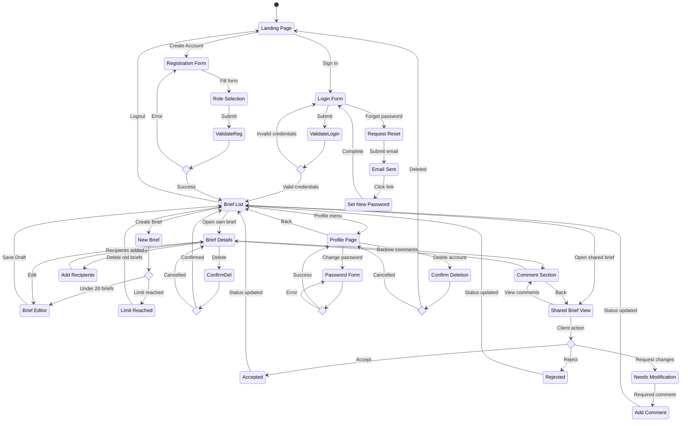

# User Journey Diagram - B2Proof

This diagram visualizes the user journey for the login, registration, and core application modules.



## Journey Overview

### Unauthenticated Users
1. **Landing Page**: Entry point where users can choose to sign in or create an account
2. **Login**: Authenticate with email and password to access the dashboard
3. **Registration**: Create new account with role selection (Creator or Client)

### Authenticated Creators
1. **Brief List**: Central dashboard showing all briefs with status and metadata
2. **Create Brief**: Form to create new brief (limited to 20 active briefs)
3. **Edit Brief**: Modify existing brief content (resets status to Draft)
4. **Share Brief**: Add recipients by email (up to 10 per brief)
5. **Delete Brief**: Permanently remove brief with confirmation

### Authenticated Clients
1. **View Shared Brief**: Read-only access to briefs shared with them
2. **Status Actions**: Accept, Reject, or Request Modification
3. **Comments**: Add feedback visible to all stakeholders

### Profile Management
1. **Change Password**: Update password with current password verification
2. **Delete Account**: Permanently delete account and all associated data

## Status Workflow

```
Draft --> Sent --> Accepted
                   Rejected
                   Needs Modification --> (Creator edits) --> Draft
```

- **Draft**: Initial state, brief not yet shared
- **Sent**: Brief shared with at least one recipient
- **Accepted**: Client approved the brief
- **Rejected**: Client declined the brief
- **Needs Modification**: Client requested changes (requires comment)
