# UI Components Architecture - B2Proof

This diagram visualizes the Next.js 15 App Router pages and React components architecture for the login, registration, and brief management modules.

```mermaid
flowchart TD
    subgraph "Root Application"
        RootLayout["RootLayout (Server)"]
    end

    subgraph "Authentication Module"
        AuthLayout["AuthLayout (Server)"]
        LoginPage["LoginPage (Server)"]
        RegisterPage["RegisterPage (Server)"]
        ResetPasswordPage["ResetPasswordPage (Server)"]
        AuthCallback["AuthCallback (Server)"]

        LoginForm["LoginForm (Client)"]
        RegisterForm["RegisterForm (Client)"]
        ResetPasswordForm["ResetPasswordForm (Client)"]

        PasswordInput["PasswordInput (Client)"]
        PasswordValidation["PasswordValidation (Client)"]
        RoleSelector["RoleSelector (Client)"]
    end

    subgraph "Main Application Layout"
        MainLayout["MainLayout (Server)"]
        NavBar["NavBar (Client)"]
        MobileMenu["MobileMenu (Client)"]
        Breadcrumbs["Breadcrumbs (Server)"]
        UserMenu["UserMenu (Client)"]
    end

    subgraph "Brief List Module"
        BriefsPage["BriefsPage (Server)"]
        BriefList["BriefList (Server)"]
        BriefCard["BriefCard (Server)"]
        StatusBadge["StatusBadge (Server)"]
        BriefLimitIndicator["BriefLimitIndicator (Server)"]
        Pagination["Pagination (Client)"]
        CreateBriefButton["CreateBriefButton (Server)"]
    end

    subgraph "Brief Detail Module"
        BriefDetailPage["BriefDetailPage (Server)"]
        BriefView["BriefView (Server)"]
        BriefHeader["BriefHeader (Server)"]
        BriefContent["BriefContent (Server)"]
        BriefFooter["BriefFooter (Server)"]
        BriefMetadata["BriefMetadata (Server)"]
        StatusActions["StatusActions (Client)"]
        DeleteBriefDialog["DeleteBriefDialog (Client)"]
    end

    subgraph "Brief Form Module"
        NewBriefPage["NewBriefPage (Server)"]
        EditBriefPage["EditBriefPage (Server)"]
        BriefForm["BriefForm (Client)"]
        WysiwygEditor["WysiwygEditor (Client)"]
        CharacterCounter["CharacterCounter (Client)"]
        StatusResetWarning["StatusResetWarning (Client)"]
    end

    subgraph "Sharing Module"
        ShareSection["ShareSection (Server)"]
        ShareDialog["ShareDialog (Client)"]
        ShareForm["ShareForm (Client)"]
        RecipientsList["RecipientsList (Server)"]
        RecipientItem["RecipientItem (Client)"]
    end

    subgraph "Comment Module"
        CommentSection["CommentSection (Server)"]
        CommentList["CommentList (Server)"]
        CommentItem["CommentItem (Client)"]
        CommentForm["CommentForm (Client)"]
        RoleLabel["RoleLabel (Server)"]
    end

    subgraph "Profile Module"
        ProfilePage["ProfilePage (Server)"]
        PasswordChangeForm["PasswordChangeForm (Client)"]
        DeleteAccountDialog["DeleteAccountDialog (Client)"]
    end

    subgraph "Shared UI Components"
        Button["Button"]
        Input["Input"]
        Card["Card"]
        Dialog["Dialog"]
        Form["Form"]
        Toast["Sonner Toast"]
        Skeleton["Skeleton"]
        Badge["Badge"]
    end

    %% Root Layout connections
    RootLayout --> AuthLayout
    RootLayout --> MainLayout

    %% Auth Layout connections
    AuthLayout --> LoginPage
    AuthLayout --> RegisterPage
    AuthLayout --> ResetPasswordPage
    AuthLayout --> AuthCallback

    LoginPage --> LoginForm
    RegisterPage --> RegisterForm
    ResetPasswordPage --> ResetPasswordForm

    LoginForm --> PasswordInput
    RegisterForm --> PasswordInput
    RegisterForm --> PasswordValidation
    RegisterForm --> RoleSelector

    %% Main Layout connections
    MainLayout --> NavBar
    MainLayout --> Breadcrumbs
    NavBar --> MobileMenu
    NavBar --> UserMenu

    MainLayout --> BriefsPage
    MainLayout --> BriefDetailPage
    MainLayout --> NewBriefPage
    MainLayout --> EditBriefPage
    MainLayout --> ProfilePage

    %% Brief List connections
    BriefsPage --> BriefList
    BriefsPage --> CreateBriefButton
    BriefsPage --> BriefLimitIndicator
    BriefList --> BriefCard
    BriefList --> Pagination
    BriefCard --> StatusBadge

    %% Brief Detail connections
    BriefDetailPage --> BriefView
    BriefDetailPage --> StatusActions
    BriefDetailPage --> ShareSection
    BriefDetailPage --> CommentSection
    BriefDetailPage --> DeleteBriefDialog

    BriefView --> BriefHeader
    BriefView --> BriefContent
    BriefView --> BriefFooter
    BriefView --> BriefMetadata
    BriefView --> StatusBadge

    %% Brief Form connections
    NewBriefPage --> BriefForm
    EditBriefPage --> BriefForm
    EditBriefPage --> StatusResetWarning
    BriefForm --> WysiwygEditor
    BriefForm --> CharacterCounter

    %% Sharing connections
    ShareSection --> ShareDialog
    ShareSection --> RecipientsList
    ShareDialog --> ShareForm
    RecipientsList --> RecipientItem

    %% Comment connections
    CommentSection --> CommentList
    CommentSection --> CommentForm
    CommentList --> CommentItem
    CommentItem --> RoleLabel

    %% Profile connections
    ProfilePage --> PasswordChangeForm
    ProfilePage --> DeleteAccountDialog
    PasswordChangeForm --> PasswordInput
    PasswordChangeForm --> PasswordValidation

    %% Shared component dependencies
    LoginForm -.-> Form
    LoginForm -.-> Button
    LoginForm -.-> Input
    RegisterForm -.-> Form
    RegisterForm -.-> Button
    BriefCard -.-> Card
    BriefCard -.-> Badge
    ShareDialog -.-> Dialog
    DeleteBriefDialog -.-> Dialog
    DeleteAccountDialog -.-> Dialog
    StatusActions -.-> Button
    CommentForm -.-> Form
    CommentForm -.-> Button

    %% Style definitions
    classDef serverComponent fill:#e1f5fe,stroke:#01579b,stroke-width:2px
    classDef clientComponent fill:#fff3e0,stroke:#e65100,stroke-width:2px
    classDef sharedComponent fill:#f3e5f5,stroke:#7b1fa2,stroke-width:2px
    classDef layoutComponent fill:#e8f5e9,stroke:#2e7d32,stroke-width:2px

    %% Apply styles to layouts
    class RootLayout,AuthLayout,MainLayout layoutComponent

    %% Apply styles to server components
    class LoginPage,RegisterPage,ResetPasswordPage,AuthCallback serverComponent
    class BriefsPage,BriefList,BriefCard,StatusBadge serverComponent
    class BriefLimitIndicator,CreateBriefButton serverComponent
    class BriefDetailPage,BriefView,BriefHeader serverComponent
    class BriefContent,BriefFooter,BriefMetadata serverComponent
    class NewBriefPage,EditBriefPage serverComponent
    class ShareSection,RecipientsList serverComponent
    class CommentSection,CommentList,RoleLabel serverComponent
    class ProfilePage,Breadcrumbs serverComponent

    %% Apply styles to client components
    class LoginForm,RegisterForm,ResetPasswordForm clientComponent
    class PasswordInput,PasswordValidation,RoleSelector clientComponent
    class NavBar,MobileMenu,UserMenu clientComponent
    class Pagination,StatusActions,DeleteBriefDialog clientComponent
    class BriefForm,WysiwygEditor,CharacterCounter clientComponent
    class StatusResetWarning clientComponent
    class ShareDialog,ShareForm,RecipientItem clientComponent
    class CommentItem,CommentForm clientComponent
    class PasswordChangeForm,DeleteAccountDialog clientComponent

    %% Apply styles to shared components
    class Button,Input,Card,Dialog,Form,Toast,Skeleton,Badge sharedComponent
```

<mermaid_diagram>

</mermaid_diagram>

## Legend

| Color | Component Type |
|-------|----------------|
| 🟢 Green | Layout Components |
| 🔵 Blue | Server Components |
| 🟠 Orange | Client Components |
| 🟣 Purple | Shared UI Components (Shadcn/ui) |

## Component Descriptions

### Authentication Module
- **AuthLayout**: Server layout for public auth pages without main navigation
- **LoginForm**: Client component handling email/password login with validation
- **RegisterForm**: Client component with role selection (creator/client)
- **PasswordInput**: Reusable password field with show/hide toggle
- **PasswordValidation**: Visual checklist for password requirements
- **RoleSelector**: Radio button group for role selection

### Brief Management
- **BriefList**: Server component displaying paginated brief cards
- **BriefCard**: Server component showing brief summary with status badge
- **BriefForm**: Client component with TipTap WYSIWYG editor
- **StatusActions**: Client component with Accept/Reject/Needs Modification CTAs
- **StatusResetWarning**: Modal warning about status reset on edit

### Sharing System
- **ShareSection**: Container for sharing functionality (creator only)
- **ShareDialog**: Modal for adding recipients by email
- **RecipientsList**: List of current recipients with remove access option

### Comment System
- **CommentSection**: Container for comments with form and list
- **CommentForm**: Client component for adding new comments
- **CommentItem**: Comment display with author role label and delete option

### Profile Management
- **PasswordChangeForm**: Form for changing password with validation
- **DeleteAccountDialog**: Confirmation modal for account deletion
